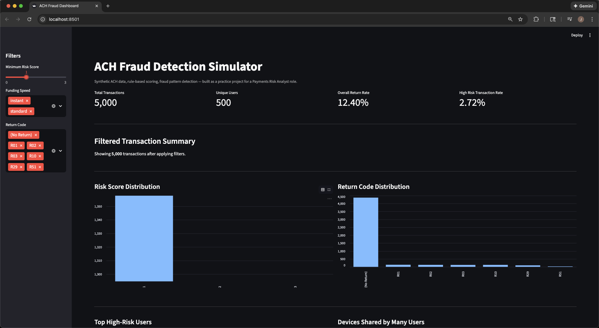
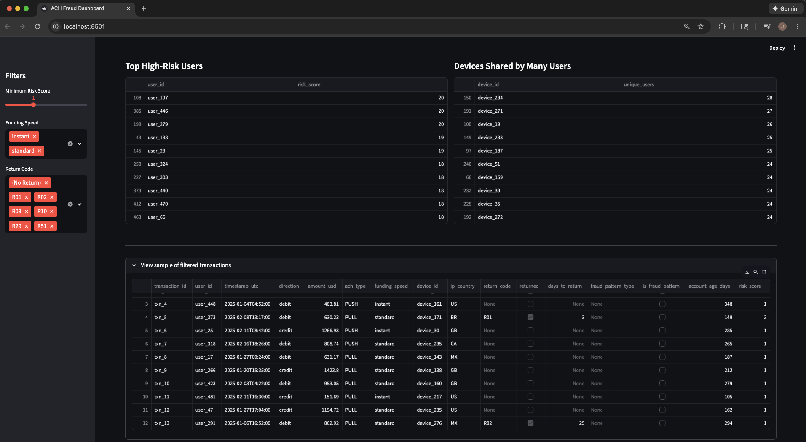

# ACH Fraud Detection Simulator

Synthetic ACH transaction data, fraud patterns, rule based scoring, and an interactive dashboard.  
Built to practice how modern payments risk systems behave in a fintech environment.




<p align="center">
  <em>Interactive Streamlit dashboard showing risk scores, return codes, and suspicious devices.</em>
</p>

---

## At a glance

**What this project demonstrates:**

- Ability to think like a payments risk analyst.
- Understanding of ACH flows, return behavior, and fraud patterns.
- Python and pandas for data generation and analysis.
- Rule based risk scoring that is explainable and transparent.
- Streamlit dashboard design that mirrors internal fraud tooling.
- Jupyter Notebook storytelling for interviews and walkthroughs.
- End to end workflow design from data creation to modeling to visualization.

**What you can review directly on GitHub:**

- Risk logic in `src/risk_rules.py`.
- Data generation workflow in `src/generate_synthetic_data.py`.
- Scored outputs and examples in `data/`.
- Full exploratory analysis notebook in `notebooks/ach_fraud_analysis.ipynb`.
- Dashboard implementation in `dashboard/streamlit_app.py`.

---

## What this project does

This project is an end to end ACH risk simulation designed to mirror the work of a payments risk analyst or fraud investigator.

### 1. Generates synthetic users and ACH transactions

- Users have varying account ages and devices.
- Transactions include timestamps, amounts, direction, funding speed, and device IDs.
- ACH return codes include R01, R02, R03, R10, R29, and R51.

### 2. Injects realistic fraud patterns

- Instant ACH abuse in new accounts.
- First party fraud behavior.
- Synthetic identity patterns such as repeated invalid or closed accounts.
- Device sharing across many accounts.

### 3. Scores transactions with rule based detection

- Flags high value instant ACH from new users.
- Flags rapid high risk returns such as R01, R10, and R29.
- Flags devices linked to many unique users (possible account farms).
- Produces a simple `risk_score` and an alerts list.

### 4. Analyzes behavior in a notebook

- Return rates and return code distributions.
- Instant vs standard funding comparison.
- High risk users and devices.
- Rule performance measured against synthetic `is_fraud_pattern` labels.
- Precision and recall to show how rules perform.

### 5. Visualizes insights in a Streamlit dashboard

- Filters for funding speed, risk score, and return codes.
- Risk score distribution chart.
- High level KPIs.
- Top high risk users.
- Most suspicious devices.
- Easy to navigate interface that mimics internal tooling.

---

## Tech stack

- **Python** for all core logic.
- **pandas** for fraud analysis and transformations.
- **Jupyter Notebook** for exploration and storytelling.
- **Streamlit** for the dashboard.
- **matplotlib** for charts inside the notebook.

---

## Repository structure

```text
ach-fraud-detection-simulator/
├─ data/
│  ├─ users.csv                     # synthetic users (generated)
│  ├─ ach_transactions.csv          # synthetic ACH transactions (generated)
│  ├─ ach_transactions_scored.csv   # transactions with risk_score (generated)
│  └─ alerts.csv                    # long table of rule hits (generated)
│
├─ src/
│  ├─ generate_synthetic_data.py    # builds users and transactions
│  ├─ risk_rules.py                 # rule based detection and scoring
│  └─ run_scoring.py                # ties data and rules together
│
├─ dashboard/
│  └─ streamlit_app.py              # interactive ACH fraud dashboard
│
├─ notebooks/
│  └─ ach_fraud_analysis.ipynb      # exploratory analysis and evaluation
│
└─ docs/
   ├─ ACH_Fraud_Report.md           # written risk analysis and commentary
   └─ img/
      └─ dashboard.png              # dashboard screenshot (add this)
```

---

## How to review this project on GitHub without running anything

You can understand the entire system without setting up a development environment:

1. **Review the rules**
   `src/risk_rules.py` describes each rule with comments.

2. **Check the notebook**
   `notebooks/ach_fraud_analysis.ipynb` shows return behavior, scoring analysis, charts, and reasoning.

3. **Read the risk report**
   `docs/ACH_Fraud_Report.md` provides a high level narrative similar to internal fraud documentation.

4. **Scan the dashboard code**
   `dashboard/streamlit_app.py` shows how KPIs, filters, and risk visualizations are built.

You can fully understand the workflow from data creation to analysis to dashboard without installing or running anything.

---

## How to run it locally (optional)

<details>
<summary>Setup and run instructions</summary>

### 1. Clone the repository

```bash
git clone https://github.com/cloudquiza/ach-fraud-detection-simulator.git
cd ach-fraud-detection-simulator
```

### 2. Create and activate a virtual environment

```bash
python3 -m venv .venv
source .venv/bin/activate
```

### 3. Install dependencies

```bash
pip install pandas numpy jupyter streamlit matplotlib
```

### 4. Generate synthetic data

```bash
python src/generate_synthetic_data.py
```

### 5. Score transactions with risk rules

```bash
python src/run_scoring.py
```

### 6. Launch the Streamlit dashboard

```bash
streamlit run dashboard/streamlit_app.py
```

### 7. Open the notebook

```bash
jupyter notebook
```

Then open:
`notebooks/ach_fraud_analysis.ipynb`

</details>

---

## Why I built this

I created this project to practice thinking through ACH risk in a structured way, work with synthetic data safely, and build a complete workflow that mirrors real world risk analysis.

It also serves as a fresh, concrete example I can walk through during interviews so I can explain risk concepts clearly and avoid relying only on older experience. I used AI throughout the build to move faster and stay focused on learning the actual risk signals rather than boilerplate setup.

If you work in payments risk, fraud, or trust and safety and have ideas for ways to extend this project or explore additional patterns, I would love to hear them.

---
